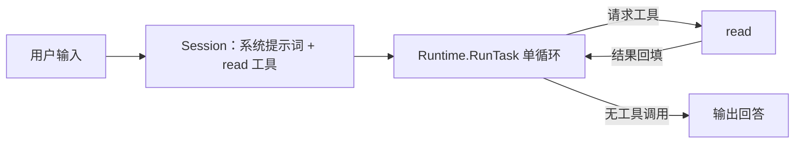
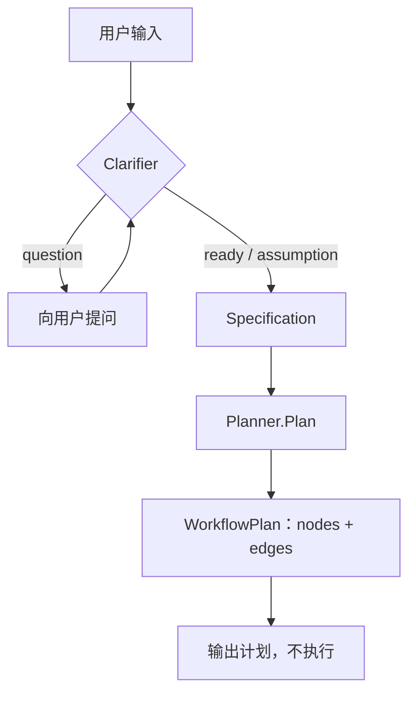
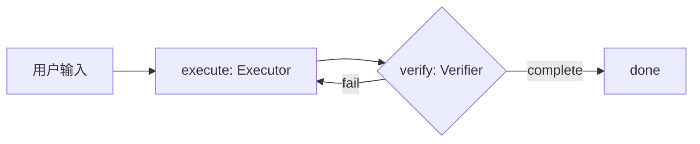
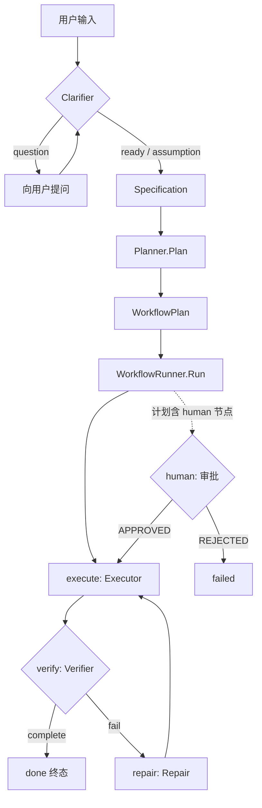
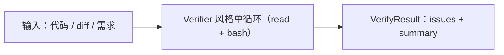
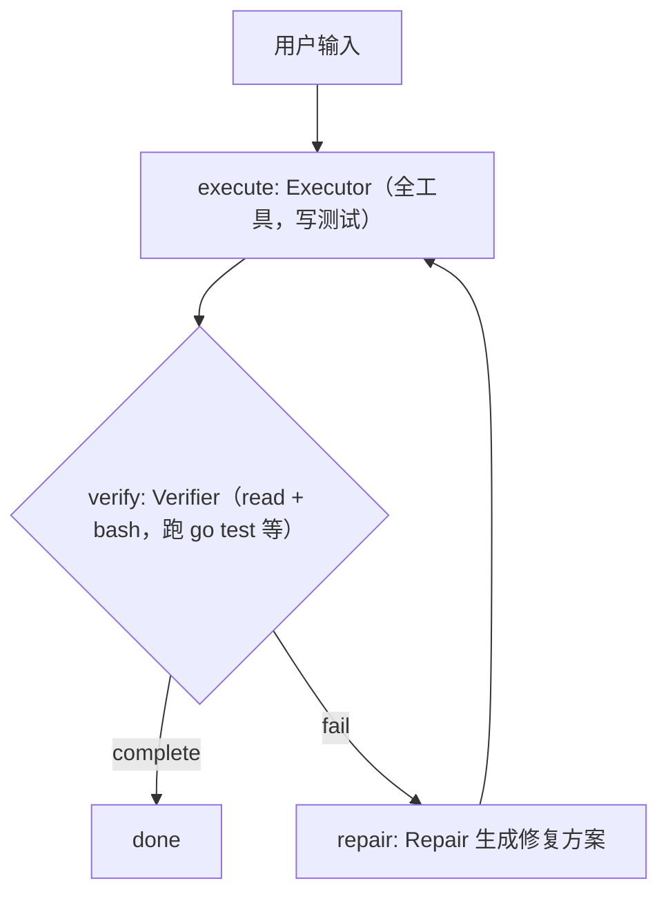
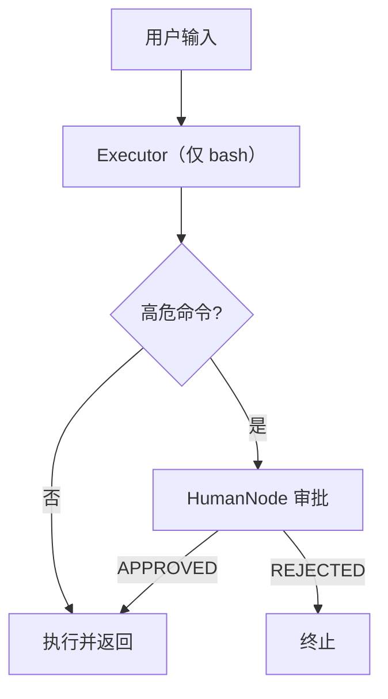
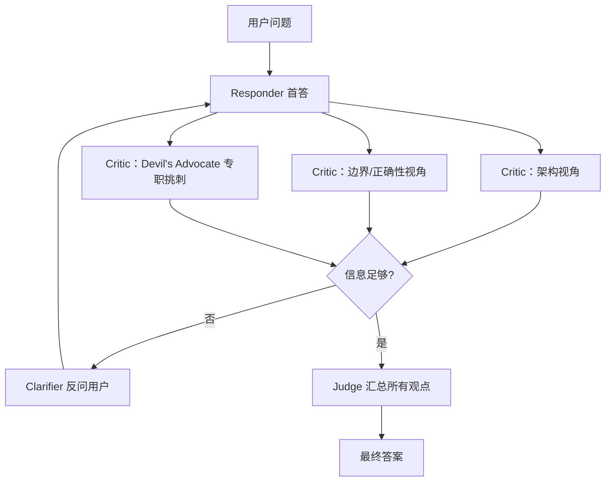

# mode

模式（Mode）是对角色（roles）与编排层（workflow）的一次组合：每个模式根据侧重点不同，
挑选不同的角色、以不同的顺序和循环方式把它们串起来。

| Mode                   | 典型行为                                                                                        | 适合场景                 |
|------------------------|---------------------------------------------------------------------------------------------|----------------------|
| **Ask / Chat**         | 只读代码、分析、回答问题，不修改文件                                                                          | 理解代码、定位问题、方案讨论       |
| **Plan**               | 分析需求 → 检查代码 → 制定修改计划，但暂不执行                                                                  | 大型重构、复杂 feature，spec |
| **Code / Edit**        | 可以修改代码、创建文件、运行基础工具                                                                          | 日常开发                 |
| **Agent / Autonomous** | 自主读代码 → 修改 → 执行命令 → 测试 → 根据结果继续修复                                                           | 完整实现一个需求             |
| **Review**             | 只关注代码质量、潜在 bug、安全性、性能等，通常不直接修改                                                              | Code review          |
| **Test**               | 创建/修改测试、运行测试、分析失败                                                                           | 单元测试和集成测试，冒烟测试       |
| **Terminal / Execute** | 强调 shell、构建、运行、安装依赖等操作                                                                      | 环境操作、构建部署            |
| **Deliberate**         | 先让一个 AI 回答，再让几个不同角度的 AI 分别点评、质疑和补充，其中一个专门"挑刺"。如果信息不够，AI 可以反过来问用户。最后再由一个 AI 汇总所有观点，给出更全面的答案  | 设计，提问，学习             |

## 目录结构与分层

模式层的代码位于 `internal/agent/modes/`，每个模式一个文件。模式本身不写业务逻辑，
它的全部职责是：**限工具、选角色、定流转**。

```
internal/agent/
├── core/                     # 运行时基座：所有模式的最终执行层
│   ├── runtime.go            #   Runtime.RunTask：LLM ↔ 工具 循环（MaxTurns 上限）
│   ├── task.go               #   Task 数据结构
│   ├── session.go            #   Session：消息时间线 / Provider / token 统计
│   └── specification.go      #   Specification：结构化需求（Clarifier 的输出）
│
├── roles/                    # 角色 Agent：一个角色 = 系统提示词 + 工具集 + 输入输出协议
│   ├── clarifier.go          #   需求澄清：输出 ready / question / assumption
│   ├── planner.go            #   规划：Specification → WorkflowPlan（nodes/edges）
│   ├── executor.go           #   执行：工具受限的 RunTask 封装（Tools 字段限制工具集）
│   ├── verifier.go           #   验证：只读裁判，输出 PASS / FAIL + issues
│   ├── repair.go             #   修复：失败原因 → FixPlan（交给 Executor 执行）
│   ├── judge.go              #   裁判/汇总（Deliberate 依赖，当前为空 struct，待实现）
│   └── *_prompt.go           #   各角色的系统提示词
│
├── workflow/                 # 编排层：把 WorkflowPlan 变成状态机并驱动到终态
│   ├── runner.go             #   WorkflowRunner：编译 plan → wf.Engine.Run
│   │                         #   ExecuteNode：按节点类型分发给对应角色
│   │                         #   resolveAction：节点结果 → 流转 action（complete/fail）
│   └── human_node.go         #   HumanNode：人工审批（发布 HumanApprovalEvent，等待 Approve/Reject）
│
├── parse/                    # 模型输出 → 命令 option 的解析
└── modes/                    # 模式层：每个模式一个文件（本文档的主角）
    ├── mode.go               #   （待建）Mode 统一接口 + 按名构造
    ├── ask.go                #   Ask / Chat
    ├── plan.go               #   Plan
    ├── code.go               #   Code / Edit
    ├── agent.go              #   Agent / Autonomous
    ├── review.go             #   Review
    ├── test.go               #   Test
    ├── terminal.go           #   Terminal / Execute
    └── deliberate.go         #   （待建）Deliberate
```

依赖方向（禁止反向，避免循环）：

```
modes → workflow → roles → core → parse / handler / llm
                    │
                    └── pkg/workflow（状态机引擎，workflow 包内以别名 wf 引用）
```

## 统一编排骨架

所有模式共享同一套底座，区别只在"选哪些角色、怎么串"。建议用统一接口收口：

```go
// internal/agent/modes/mode.go
package modes

// Mode 是一个交互模式的编排器。
// 模式只做三件事：限工具、选角色、定流转；具体执行一律委托底座。
type Mode interface {
	// Name 返回模式名，供 CLI 参数与 TUI 切换使用。
	Name() string

	// Run 执行任务直到结束，返回最终答复。
	Run(task *core.Task) (string, error)
}

// For 按名称构造模式（默认 code）。
func For(name string, rt *core.Runtime) Mode { ... }
```

编排只有两条原语：

| 原语 | 做法 | 适用 |
|------|------|------|
| **直连执行** | 模式内构建 Task + Session，直接调 `roles.XXX` / `Runtime.RunTask` | 单角色、线性流程，无循环 |
| **状态机执行** | `Planner.Plan` 生成 WorkflowPlan（或直接用 `roles.DefaultWorkflowPlan()`）→ `WorkflowRunner.Run` | 多角色、可回环、可人工审批 |

`WorkflowRunner` 的状态机由 `pkg/workflow` 引擎自动驱动：
进入状态 → `ExecuteNode` 分发给对应角色 → `resolveAction` 把结果映射为 action → 流转，直到终态。
角色与节点类型的对应关系：

| 节点类型 | 角色 | 工具集 | resolveAction 映射 |
|---------|------|--------|--------------------|
| `execute` | Executor | 节点声明的 `tools` | 恒为 `complete` |
| `verify`  | Verifier | `read` + `bash` | `PASS` → `complete`，否则 `fail` |
| `repair`  | Repair | 全部 | 恒为 `complete`（修复后回 execute） |
| `human`   | HumanNode | 无（等人） | `APPROVED` → `complete`，`REJECTED` → `fail` |

任务生命周期（概念阶段，各模式按需走其中一段）：

```
CREATED → CLARIFYING → PLANNING → RUNNING → VERIFYING → COMPLETED / FAILED
```

不同模式只走其中一段，见文末速查表。

---

## Ask / Chat

只读问答：不澄清、不规划、不进状态机，单角色单循环。
工具只给 `read`，从根上保证"不改文件"。

### 流程编排



1. 构建 Task，Session 注入系统提示词（`utils.GetSystemPrompt`）与 `read` 工具说明
2. `Runtime.RunTask` 驱动对话循环：模型可反复 read 项目文件，直到不再请求工具
3. 模型纯文本回复即为答案；不经过 Clarifier / Planner / WorkflowRunner

### 实现与目录

```go
// internal/agent/modes/ask.go
type AskMode struct{ Runtime *core.Runtime }

func (m *AskMode) Name() string { return "ask" }

func (m *AskMode) Run(task *core.Task) (string, error) {
	executor := &roles.Executor{Runtime: m.Runtime, Tools: []string{"read"}}
	return executor.Execute(task)
}
```

- 复用 `roles.Executor`：它内部调 `Runtime.RunTask`，`Tools` 字段裁剪工具集
- 状态推进：`CREATED → RUNNING → COMPLETED`
- 实现状态：**待实现**（modes/ask.go 为占位空文件）

---

## Plan

分析需求 → 制定计划，但**暂不执行**：流程在 `PLANNING` 截止，不进入 `RUNNING`。

### 流程编排



1. **CLARIFYING**：`Clarifier.Clarify(input)` 分析需求
   - `status=question`：把 `Questions` 列表返回给用户，用户回答后拼进输入重新 Clarify
   - `status=assumption`：记录 `Assumptions`，不阻塞，直接往下走
   - `status=ready`：直接往下走
2. **PLANNING**：`Planner.Plan(spec)` 读取项目代码，输出 `WorkflowPlan`
3. 把 `WorkflowPlan` / 计划文本作为答复返回，**不调用 WorkflowRunner**

### 实现与目录

```go
// internal/agent/modes/plan.go
func (m *PlanMode) Run(task *core.Task) (string, error) {
	// CLARIFYING：Clarifier 输出 Specification（question 时与用户往返）
	clarifier := &roles.Clarifier{Runtime: m.Runtime}
	result, err := clarifier.Clarify(task.Input)
	if err != nil {
		return "", err
	}
	task.Specification = result.Specification

	// PLANNING：Specification → WorkflowPlan
	planner := &roles.Planner{Runtime: m.Runtime}
	plan, err := planner.Plan(task.Specification)
	if err != nil {
		return "", err
	}
	return formatPlan(plan), nil // 只返回计划文本
}
```

- 复用 `roles.Clarifier`（只读，`read`）与 `roles.Planner`（只读，`read`）
- 两个角色的输出解析目前是简化实现（`parseClarifyResult` / `parseWorkflowPlan` 标记 TODO，
  当前 Clarifier 恒返回 ready、Planner 恒返回 `DefaultWorkflowPlan`），接入前需补 JSON 解析
- 状态推进：`CREATED → CLARIFYING → PLANNING`（不进 RUNNING）
- 实现状态：**待实现**

---

## Code / Edit

日常开发：直接干活。轻量任务用**直连执行**；想带验证时用**默认计划**走一次
execute → verify 的迷你状态机。

### 流程编排

直连（默认）：


带验证（可选，`DefaultWorkflowPlan`）：



### 实现与目录

```go
// internal/agent/modes/code.go
func (m *CodeMode) Run(task *core.Task) (string, error) {
	// 方式一：直连，全工具单循环
	executor := &roles.Executor{Runtime: m.Runtime}
	return executor.Execute(task)

	// 方式二：默认计划，execute → verify 回环
	// return m.runPlan(task, roles.DefaultWorkflowPlan())
}
```

- 复用 `roles.Executor`（全工具）与 `roles.DefaultWorkflowPlan()`（无需 Planner 参与）
- 状态推进：`CREATED → RUNNING → COMPLETED`（方式二多一段 `VERIFYING`）
- 实现状态：**待实现**

---

## Agent / Autonomous

完整闭环，也是所有角色的"全家桶"：澄清 → 规划 → 状态机执行
（执行 → 验证 → 修复回环 + 人工审批）。

### 流程编排



1. **CLARIFYING**：同 Plan 模式，产出 `Specification`（含验收标准 `acceptance_criteria`）
2. **PLANNING**：`Planner.Plan` 把 Specification 编译成 `WorkflowPlan`（节点类型 execute/verify/repair/human）
3. **RUNNING / VERIFYING**：`WorkflowRunner.Run(plan, task)` 接管：
   - 每个 State 挂 `nodeHandlerAdapter`，`Handle` 内调 `ExecuteNode` 分发给对应角色
   - `verify` 失败 → `repair` 生成 FixPlan（追加到 `task.Input`，`RetryCount++`）→ 回 `execute`
   - 回环受 `task.MaxRetries`（默认 3）约束，由编排层校验 `RetryCount` 防死循环
   - `human` 节点：发布 `HumanApprovalEvent` 给 CLI/TUI，`HumanNode.Wait()` 阻塞等待 `Approve/Reject`
4. 引擎到终态后返回，`COMPLETED` 或 `FAILED`

### 实现与目录

```go
// internal/agent/modes/agent.go
func (m *AgentMode) Run(task *core.Task) (string, error) {
	// 1. CLARIFYING
	clarify, err := (&roles.Clarifier{Runtime: m.Runtime}).Clarify(task.Input)
	if err != nil {
		return "", err
	}
	task.Specification = clarify.Specification

	// 2. PLANNING
	plan, err := (&roles.Planner{Runtime: m.Runtime}).Plan(task.Specification)
	if err != nil {
		return "", err
	}

	// 3. 状态机执行（WorkflowRunner 内部驱动 pkg/workflow 引擎）
	return "", workflow.NewWorkflowRunner(m.Runtime).Run(plan, task)
}
```

- 这是唯一**必须**经过 `internal/agent/workflow` + `pkg/workflow` 的模式；
  其余模式用直连原语即可
- 复用全部角色 + `HumanNode`；`HumanApprovalEvent` 经 `Runtime.Publish` 发布，
  UI 侧订阅后调 `Node.Approve()/Reject()` 放行
- 状态推进：全生命周期 `CREATED → CLARIFYING → PLANNING → RUNNING → VERIFYING → COMPLETED/FAILED`
- 实现状态：**待实现**

---

## Review

只读评审：复用 Verifier 的"只读裁判"套路，但输入从"任务执行结果"换成
"代码 / diff / 需求描述"，输出统一为 `VerifyResult`（passed / issues / summary）。
不做澄清和规划，也不修改任何文件。

### 流程编排



1. 构建 Task，注入评审系统提示词（质量、bug、安全、性能四个维度）
2. `Runtime.RunTask` 单循环：模型可 read 代码、bash 跑编译/测试佐证结论，但**不给写工具**
3. 按 Verifier 的输出协议解析为 `VerifyResult`，issues 按 `critical/warning/info` 分级

### 实现与目录

```go
// internal/agent/modes/review.go
func (m *ReviewMode) Run(task *core.Task) (string, error) {
	// 评审提示词：新增 roles/review_prompt.go，或直接复用 verifierSystemPrompt 改写
	task.SessionInfo.Messages = []llm.ChatMessage{
		{Role: llm.RoleSystem, Content: reviewSystemPrompt},
		{Role: llm.RoleUser, Content: task.Input},
	}
	err, result := m.Runtime.RunTask(task)
	if err != nil {
		return "", err
	}
	return result, nil // 调用方可经 roles.parseVerifyResult 得到结构化 issues
}
```

- 工具集 `read` + `bash`（与 Verifier 一致，`bash` 仅为运行验证命令）
- 状态推进：`CREATED → RUNNING → COMPLETED`
- 实现状态：**待实现**

---

## Test

写测试、跑测试、分析失败：本质是 Code 模式 + 强制验证 + 修复回环。
计划固定，无需 Planner 参与，直接用 `DefaultWorkflowPlan`（或手工加一个 repair 节点）。

### 流程编排



1. **RUNNING**：Executor（全工具）创建/修改测试文件与被测代码
2. **VERIFYING**：Verifier 实际运行测试（`go test ./...` 等），不轻信"我写好了"
3. 失败 → Repair 出修复方案 → 回 execute，受 `MaxRetries` 约束

### 实现与目录

```go
// internal/agent/modes/test.go
func (m *TestMode) Run(task *core.Task) (string, error) {
	plan := roles.DefaultWorkflowPlan() // execute → verify → (fail 回 execute)
	return "", workflow.NewWorkflowRunner(m.Runtime).Run(plan, task)
}
```

- 复用 `roles.DefaultWorkflowPlan()` + `WorkflowRunner`；想带修复回环时在 plan 中追加
  repair 节点与 `fail` 边（参考 `planner_prompt.go` 的"完整流程"模式）
- 状态推进：`CREATED → RUNNING → VERIFYING → COMPLETED/FAILED`
- 实现状态：**待实现**

---

## Terminal / Execute

环境操作模式：工具只给 `bash`，专注构建、运行、装依赖。
单循环直连；高危命令可选择接入 `HumanNode` 人工确认。

### 流程编排



1. Executor `Tools: []string{"bash"}`，模型通过 bash 完成所有操作
2. 可选：模式内创建 `HumanNode`，对高危命令（删除、覆盖、网络安装等）发布
   `HumanApprovalEvent`，等待用户 `Approve/Reject` 后继续（与 WorkflowRunner 的
   human 分支同一套机制）

### 实现与目录

```go
// internal/agent/modes/terminal.go
func (m *TerminalMode) Run(task *core.Task) (string, error) {
	executor := &roles.Executor{Runtime: m.Runtime, Tools: []string{"bash"}}
	return executor.Execute(task)
}
```

- 复用 `roles.Executor`；审批复用 `internal/agent/workflow.HumanNode` + `HumanApprovalEvent`
- 状态推进：`CREATED → RUNNING → COMPLETED`
- 实现状态：**待实现**

---

## Deliberate

多角色辩论：一个 Responder 首答 → 多个 Critic 从不同视角点评，其中一个专职"挑刺"
（Devil's Advocate）→ 信息不足时反问用户 → Judge 汇总所有观点给出最终答案。

这是典型的 **fan-out / fan-in** 固定编排：不进状态机，用普通 Go 代码顺序/并发调用即可，
这正是"模式即编排"的体现——流程简单时不需要引擎。

### 流程编排



1. **Responder**：一次 `RunTask`（`read`）生成首答
2. **Critics**：N 次独立 `RunTask`，每个使用不同视角的系统提示词；
   其中 Devil's Advocate 的提示词强制"只找问题、必须给出至少一个反例或风险"
3. **反问**：若观点分歧过大/信息不足，把问题交给 `Clarifier.Clarify`，
   `status=question` 时把 `Questions` 返回给用户，补充输入后回到第 1 步
4. **Judge**：汇总首答 + 全部点评，输出更全面的最终答案（这正是 `roles.Judge` 的定位）

### 实现与目录

```go
// internal/agent/modes/deliberate.go（待建）
func (m *DeliberateMode) Run(task *core.Task) (string, error) {
	answer := m.respond(task)          // Responder
	opinions := m.critics(task, answer) // N 个 Critic（含 Devil's Advocate）
	if insufficient(opinions) {
		// 复用 Clarifier 反问用户，用户回答后重跑
	}
	return m.synthesize(task, answer, opinions) // Judge 汇总
}
```

- 新增文件：`modes/deliberate.go` + `roles/judge.go`（含 `judge_prompt.go`）
- **前置依赖**：`roles.Judge` 当前是空 struct，需先实现（输入：首答 + 各点评；输出：最终答案）
- 工具集：全部角色只给 `read`（辩论是纯分析，不改代码）
- 状态推进：`CREATED → RUNNING → COMPLETED`
- 实现状态：**待实现**（依赖 Judge 实现）

---

## 模式速查表

| Mode | 角色 | 工具集 | 编排原语 | TaskStatus 路径 | 代码位置 | 状态 |
|------|------|--------|---------|-----------------|----------|------|
| Ask | Executor | `read` | 直连 | CREATED → RUNNING → COMPLETED | `modes/ask.go` | 待实现 |
| Plan | Clarifier + Planner | `read` | 直连（线性） | CREATED → CLARIFYING → PLANNING | `modes/plan.go` | 待实现 |
| Code | Executor（可选 + Verifier） | 全部 | 直连 / 默认计划 | CREATED → RUNNING（→ VERIFYING）→ COMPLETED | `modes/code.go` | 待实现 |
| Agent | 全部角色 | 全部 | 状态机 | 全生命周期 | `modes/agent.go` | 待实现 |
| Review | Verifier 风格 | `read` + `bash` | 直连 | CREATED → RUNNING → COMPLETED | `modes/review.go` | 待实现 |
| Test | Executor + Verifier + Repair | 全部 / 只读 | 默认计划 | CREATED → RUNNING → VERIFYING → COMPLETED | `modes/test.go` | 待实现 |
| Terminal | Executor + HumanNode | `bash` | 直连（+ 审批） | CREATED → RUNNING → COMPLETED | `modes/terminal.go` | 待实现 |
| Deliberate | Responder + Critics + Clarifier + Judge | `read` | 定制 fan-out/fan-in | CREATED → RUNNING → COMPLETED | `modes/deliberate.go` | 待实现（依赖 Judge） |

## 落地顺序建议

1. **骨架**：`modes/mode.go` 统一接口 + `Ask` / `Code`（验证"模式只做编排"的思路）
2. **复用 Verifier 的三个**：`Test` / `Terminal` / `Review`（只差工具集与提示词）
3. **接入澄清与规划**：`Plan` / `Agent`（补齐 Clarifier / Planner 的 JSON 解析，
   Agent 走通 WorkflowRunner 全闭环含 human 审批）
4. **辩论**：实现 `roles.Judge` 后再做 `Deliberate`

接入入口：`cmd/cli/main.go` 与 `cmd/tui/model.go` 目前直接调 `core.Runtime.RunTask`
（等价于隐式的 Code 模式）；模式层就绪后改为 `modes.For(name, runtime).Run(task)`。
